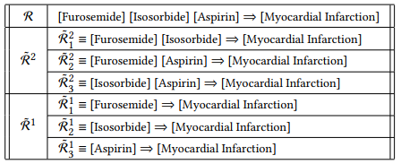
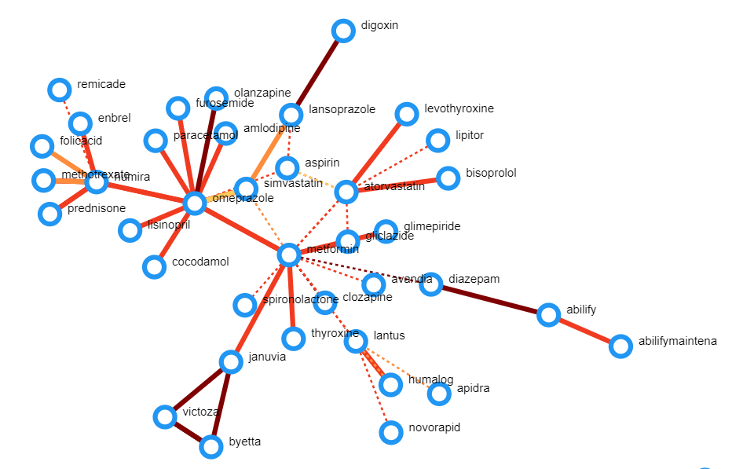
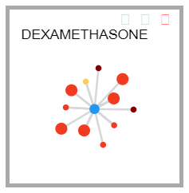

Background
==========

The Food and Drug Administration (FDA) is responsible for approving drugs for
medical use and for keeping up-to-date on the risks associated with taking those
drugs. The Center for Drug Evaluation and Research (CDER) is the specific
department at the FDA that is responsible for ensuring that "safe and effective
drugs are available to ensure the health of people in the United States" 
[@cder18]. This department regulates both over the counter and prescription
drugs, from fluoride toothpaste and sunscreen to narcotic painkillers and cancer
medications.

One part of this is ensuring that drugs continue to stand up to safety measures
after they've gone to market. Clinical trials cannot explore all the ways that
using a drug might be harmful, so the FDA must rely on data collected from
patients and hospitals during the course of their usage. One tool that the FDA
uses is by collecting reports on Adverse Drug Reactions.

An Adverse Drug Reaction (ADR), or adverse event, is defined by the Food and Drug Administration (FDA) as an
"untoward medical occurrence associated with the use of a drug". Every year,
there are over 2 Million serious ADRs, resulting in over 100,000 deaths[-@fda16]. ADRs
are the fourth leading cause of death, surpassing automobile deaths, diabetes,
and pulmonary disease. In addition, over 350,000 ADRs occur in nursing homes
annually. To gather information on ADRs, the FDA uses FDA's Adverse Event
Reporting System (FAERS)[@fda17]. The FAERS database contains information on ADR
reports submitted to the FDA by healthcare professionals and consumers. With the
mass of ADRs reported through FAERS the lack of automated tools to perform
preliminary analyses limits the usefulness of the data collected.

An interaction between multiple drugs causing one or more ADR(s) (such as taking
Aspiring and Warfarin together causing bleeding) is known as a Multi-Drug 
Adverse Reaction, or MDAR. One of the more difficult analyses to extract from
these data is multiple-drug interactions. Up to 40% of elderly people are 
prescribed more than six medications simultaneously, in so many different 
combinations that testing them all, individually, for side effects that are 
derived from the interaction between two or more of those drugs impossible.

In order to create an automated screening process for which sets of drugs are
candidates for causing MDARs, Kakar [-@wpimaras] developed the Multi-drug
Adverse Reactions Analytic System (MARAS).

## MARAS

MARAS utilizes Association Rule Learning to identify ADRs which are most 
significant. There are several challenges associated with using 
Association Rule Learning with ADRs. Applying Association Rule Learning to a 
large set of drugs and ADRs, such as the set generated by FAERS, results in an 
excessively large number of associations. It is difficult to reduce the number 
of rules to a manageable scale while still guaranteeing that potentially 
important rules are not missed. In addition, the basic association measures 
used with Association Rule Learning, such as support and confidence, do not 
appropriately rank drug-ADR associations, because they only consider individual
association rules, while MARAS has to consider the correlation among different
rules. The MARAS methodology attempts to address these concerns to 
sufficiently filter and rank drug-ADR associations in a meaningful way.

### Association Rule Learning

Association Rule Learning refers to the process of creating Association Rules
from a set of transactions, where an Association Rule is defined as a
description of the probability that, given the occurrence of one event,
another event will occur. In other words, "it helps find the relationship
between objects that are frequently used together" [@gollapudi16]. One
common example of an association rule would be that if a
customer purchases an iPad, they are likely to also purchase an iPad case.

The **support** of an association rule is the frequency with which the items
appear together compared to the total number of transactions. More formally,
the support of a rule $X \rightarrow Y$ is defined as: $Support = frq(X,Y)/N$
where *N* is the number of transactions.

The **confidence** of an association rule $X \rightarrow Y$ is the frequency with
which the items appear together compared to the frequency that $X$ appears by
itself; in other words:

$$Confidence = \frac{frq(X,Y)}{frq(X)}$$

The **lift** of an association rule $X \rightarrow Y$ is the support of the rule
compared to the product of the supports of $X$ and $Y$ individually.

$$Lift = \frac{support(X,Y)}{support(X) \times support(Y)}$$

<!--### FP-growth

FP-growth is an algorithm for the implementation of Association Rule Learning.
The algorithm works by constructing FP-trees that represent patterns in the
data [@Li2007]. A pattern is determined to be frequent based on its **support**. If a
pattern's support is less than the **minimum support** specified as a
parameter to the algorithm, then that pattern is dropped from the tree and not
considered during the generation of itemsets and rules. This method of
frequent pattern generation is advantageous because it compresses large data
sets into much smaller data structures, avoids generating unnecessarily large
candidate sets, and reduces the search space by using a divide-and-conquer
method to mine patterns.

Not sure this is important.-->


### Important Concepts for MARAS

A Drug-ADR association R is a pairing of a set of Drugs D and a set of ADRs A.
The association is considered **explicitly supported** if at least one report
exists that refers exactly to the Drugs and ADRs in the association, with no
others. Meanwhile, the association is considered **implicitly supported** if it
exists as partial interpretations of two or more reports. For example, consider
a report $R_1$ with a set of drugs $D_1 = \{d_1, d_2, d_3\}$ and a set of ADRs
$A_1 = \{a_1, a_2\}$, and a report $R_2$ with a set of Drugs $D_2 = \{d_1, d_2, d_4\}$
and a set of ADRs $A_2 = \{a_1, a_2, a_3\}$. In this case, the association
$d_1, d_2, d_3 \rightarrow a_1, a_2$ is explicitly supported, since $R_1$
refers exactly to this association. The association $d_1, d_2 \rightarrow a_1, a_2$
is implicitly supported, because it is a partial interpretation of both $R_1$ and
$R_2$. An association is a **spurious association** if it is neither
explicitly nor implicitly supported.

An association is considered **closed** if it does not contain partial
information of another association. Consider 
$R_1 = d_1, d_2, d_3 \rightarrow a_1, a_2$ and $R_2 = d_1, d_2 \rightarrow a_1,a_2$.
In this case, $R_2$ is *not* closed, because it presents partial information of $R_1$.
In other words, $R_1$ provides richer information than $R_2$.

Consider a report $R_1$, an association of a set of drugs $D_1$ and adverse reactions 
$A_1$; similarly, $R_2$ is an association of a set of drugs $D_2$ and adverse reactions
$A_2$. $R_1$ is a **contextual association** of $R_2$
if $D_1$ is a subset of $D_2$ and $A_1$ is a subset of
$A_2$. For example, let $R_1 = d_1, d_2,d_3, d_4 \rightarrow a_1, a_2, a_3, a_4$;
let $R_2 = d_1, d_2 \rightarrow a_1, a_3$. In this case, $R_1$ is a
contextual association of $R_2$. A **contextual association cluster
(CAC)** contains an explicitly or implicitly supported association, and its
contextual associations.

{#fig:cac width=60%}

There are two factors to consider when measuring if a Drug-ADR association
indicates a severe Multi-Drug Association Rule (MDAR): How strong the
association is between the ADRs and drugs, and how strong the association is
between the ADRs and each individual drug, or a subset of the drugs. For the
former, we can use the traditional **confidence** measure, referenced above. For
the latter, we can use the **contrast** measure. A high contrast indicates that
the target association has a high confidence, and all of the contextual
associations within its CAC have low confidence.

### MARAS System

The MARAS System methodology describes how the Association Rule Learning
methods detailed above can be used to present Adverse Drug Reaction
information in a descriptive and informative manner. The first step in this
process is the Data Processor, which extracts and cleans drug and ADR data
from an ADR report (such as a FAERS report) so it is in the appropriate format
to be used by the MDAR signaler; The Data Processor also removes any duplicate
reports. Next, the MDAR Signaler analyzes the output of the Data Processor to
identify the non-spurious Drug-ADR associations along with their Contextual
Associations, then computes the contrast score of each CAC to identify the
strength of the signal.

The MARAS code received at the beginning of this project consisted of two main
parts. The first part of the system focused on using association learning to 
mine hypothetical drug-drug interactions from the FAERS data and the other
part was responsible for processing and filtering the data for the data mining
part and for having usable output. The processing part was further divided into
three sections: preprocessing, closure generation, and result output.

The Preprocessor builds a copy of the initial data-tables pulled from
the FAERS database by generating unique IDs for each drug and adverse reaction.
This allows the data mining step to be run efficiently. This step outputs three
files: a mapping between drug names and unique IDs, a mapping between
adverse reaction names and unique IDs, and the copy of the table of adverse reaction
reports using unique IDs instead of drug and reaction names.

The data mining element, implemented in C++, takes the preprocessed FAERS data
and finds patterns in the data that may be associated with **MDARs**. To
accomplish this task, the **FP-growth** algorithm is implemented to find the
complete set of frequent patterns in the preprocessed data. After the frequent
patterns have been generated, the program outputs two files to be used as
input to the next element in the backend. The first file contains the frequent
itemsets of drugs and their support values. Meanwhile, the second file
contains rules indicating a potential causal relationship between a drug
combination and an adverse drug reaction.

After all the rules are generated, they can be ranked using the Contrast Score.
However, due to size of the dataset, it would be inefficient to calculate the
score for every single rule reported in the last step. Therefore there is a filtering
step that ignores every rule that is entirely contained by another rule.

For example, this filtering step would ignore a rule that suggests Aspirin and Excedrin lead
to nausea if there is also a rule that suggests Aspirin and Excedrin lead to nausea and headaches.
This prevents needless computation.

The final step in the MARAS program is generating results for use in DIVA. The final program, Explorer,
sorts the list of rules by their contrast score, returning only the highest scoring. It creates three
reports, one which contains the MDARs and all associated information in a human-readable format,
one which has the support, confidence, and score in three comma-delimited columns, and a third which
contains the same information as the fist file in a comma-delimited format.


## DIVA Methodology

DIVA [@wpidiva] was developed in consultation with evaluators from the FDA to ensure a complete understanding of the current 
drug safety review process and the challenges associated with analyzing
Drug-Drug Interactions. These evaluators are domain experts in the field of drug-safety research with focuses
on multi-drug interactions. The consultations with these evaluators helped Kakar
and Qin develop a list of requirements for an application that could 
successfully assist in safety research in multi-drug interactions. The
requirements from @wpimaras are discussed below.

```
Provide an overview of all Hypothetical Drug-Drug Interactions (HDDIs)
```

: DIVA Requirement 1 {#lst:req1}

The simplest requirement is that evaluators need to have a method for easily
scanning for interesting HDDIs. They need to be able to identify those
interactions that *are* heavily supported by the data, so that they can focus
on those. That led to the second requirement:

```
Facilitate the detection of interesting HDDIs
```

: DIVA Requirement 2 {#lst:req2}

This means that, in the visualization, hypothetical interactions that are 
well-supported in the data must be visually distinct from those that are not
well-supported. This distinction must be clear enough that the most interesting
HDDIs are easy to separate from the least interesting ones. This requirement
also seems to encourage the ability to filter away the least interesting HDDIs.

```
Enable analysts to change importance criteria for HDDIs interactively
```

: DIVA Requirement 3 {#lst:req3}

Continuing the idea of filtering, this requirement shows that the different
ways that evaluators could prioritize the hypothetical interactions must all
be a part of the visualization, and switching focus between them must be
easy.

```
Facilitate detection of severe ADRs
```

: DIVA Requirement 4 {#lst:req4}

Those reactions that are immediately life-threatening are more urgent than those
that only cause mild discomfort, so it is important to find the most dangerous
ADRs, so that they can be prioritized.

```
Facilitate prioritization of drugs
```

: DIVA Requirement 5 {#lst:req5}

The previous requirements also centered around the concept of **prioritization**,
where evaluators wanted to not only filter away uninteresting hypothetical
interactions, but also to have a way to choose an order for evaluators to
examine interactions. This would allow for a project manager to choose an
order of prioritization for a team of evaluators to work on.

```
Link to underlying reports
```

: DIVA Requirement 6 {#lst:req6}

Without access to the underlying report data, the visualization is hard to draw
any conclusions from. There is significant information useful to evaluators in
the reports sent to FAERs, and that needs to be accessible from the visualization.

```
Support custom annotations on MDARs
```

: DIVA Requirement 7 {#lst:req7}

If the evaluators want a single application to provide the entire toolchain for
MDAR analysis, notetaking is indispensible. [Requirement 7](#lst:req7) allows 
for evaluation periods to take longer than one sitting, and evaluators could 
save their notes between sessions.

```
Support smooth and interactive exploration of FAERs data
```

: DIVA Requirement 8 {#lst:req8}

Usability is important for any new application that gets introduced to a work
environment. [Requirement 8](#lst:req8) reinforces that priority.

```
Use familiar visual metaphors and respect the user's mental model about 
drugs and ADRs
```

: DIVA Requirement 9 {#lst:req9}

A significant part of usability is concerned with the learning curve for new
users. Part of minimizing the difficulty of learning a new system is relying
on metaphors that the users would already be familiar with, either from 
applications they use in other areas of their work, or in daily computer use.
That is the purpose of [Requirement 9](#lst:req9).

In order to fulfill these requirements, DIVA uses four main interactive views:
Overview, Galaxy View, Profile View, and Reports view. As discussed in
@Sec:diva-interface-improvements, we renamed each of these views to more closely
reflect the user interactions associated with them.

### Overview View

The Overview allows users to analyze MDARs at a macroscopic level; this view
shows the entire space of Hypothetical Drug-Drug Interactions (HDDIs).

{#fig:overview-diva width=80%}

This view utilizes
a node-link diagram to visually display relationships between drugs and
ADRs. In this view, nodes represent drugs, and edges represent an interaction
between two drugs. If the edge is a dashed line, the interaction is known; if 
the edge is a solid line the interaction is unknown. The color of each edge 
represents the contrast score of the interaction.

### Galaxy View

The Galaxy View allows analysts to quickly get an overview of MDARs associated
with a specific drug. 

{#fig:galaxy-view-diva width=25%}

The center node of the Galaxy View represents the drug
of interest, while the nodes surrounding it represent the drugs that
interact with that drug of interest. The color of the box surrounding this
view indicates the count of severe ADRs associated with this drug. Users can
view multiple different drugs at a time, sorted by name, interaction count, or
severity as necessary. The size of each individual node indicates whether any
of the MDARs between the two drugs are unknown; if there exists at least one
unknown MDAR, the node will have a larger size than those with no unknown
MDARs. Users can find additional information about each interaction by
hovering over them.

### Profile View

The Drug Profile View provides a more detailed look at an individual drug in
the form of a modified tree layout, consisting of three levels. The root node
represents the selected drug, the second level displays all of the drugs that
interact with the selected drug, and finally, the third level represents the
ADRs that exist between the drugs. Normal ADRs are represented with a tan
color, while severe reactions are labelled purple.

{#fig:profile-view-diva width=50%}

### Reports View

The Reports View allows analysts to view the raw data directly. This view
shows a list of all reports related to a chosen drug or drug interaction,
enabling the user to see the underlying information related to a drug or ADR.
<!-- In addition, users can select a report and the drugs and reactions mentioned
will be highlighted in the Overview, Galaxy view, and Profile view. This view
also allows users to view the narrative section for each report, which may
contain important information regarding the patient's medical history; users
can search for certain key words contained in the narrative sections of the
reports. -->

{#fig:reports-view_diva width=100%}

<!-- ### Annotations

Users can annotate MDARs as "Continue Monitoring", "Duplication", or
"Co-Occurrence". "Continue Monitoring" indicates that further investigation is
required. "Duplication" states that the drugs in the ADR were taken together
for the same treatment. Finally, "Co-Occurrence" suggests that there is no
logical reason that the drugs in the MDAR would react. -->

## Minimum Viable Product

In Lean Startups, a minimum viable product (MVP) is "an experimental object that
allows for empirical testing of value hypotheses" that has been "built with a
minimum amount of effort and development time" [@minimum pp. 138]. A value
hypothesis tests if a product is capable of being valuable to its customers
once they are using it. Used in conjunction, they create an experimentation
tool that allows developers to determine if it is worth developing further.

Minimum viable products take many forms, depending on the type of project being
tested. Some projects can test if they would get customer engagement with 
merely a landing page listing the planned features. In more established 
industries, it is often necessary to evaluate the value of a particular style
of a feature and therefore a more developed MVP is required.

This project is focused on preparing the research conducted by Kakar and Qin
for experimentation that can determine the value of their work to the FDA. We
are creating a minimum viable product from the two research projects detailed
above, to test the value hypothesis that an application that mines and ranks
hypothetical drug-drug interactions from FAERS data and then serves a 
visualization fulfilling the requirements above provides valuable assistance
in detecting and evaluating MDARs.
