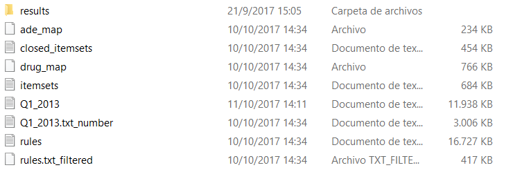
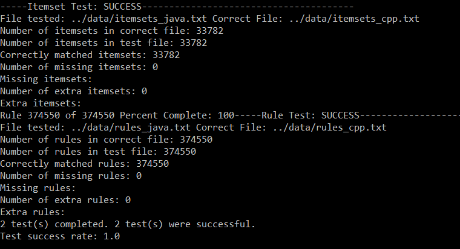
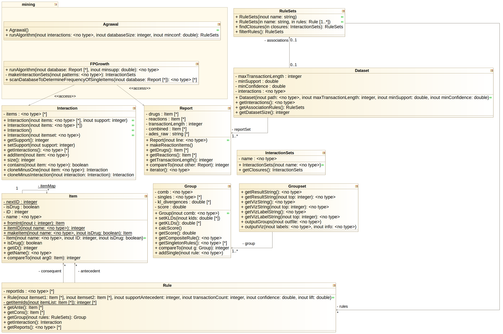
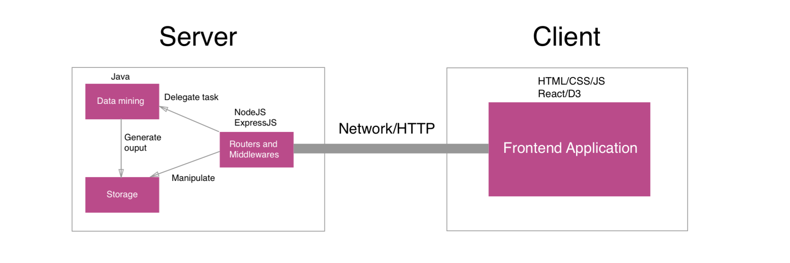
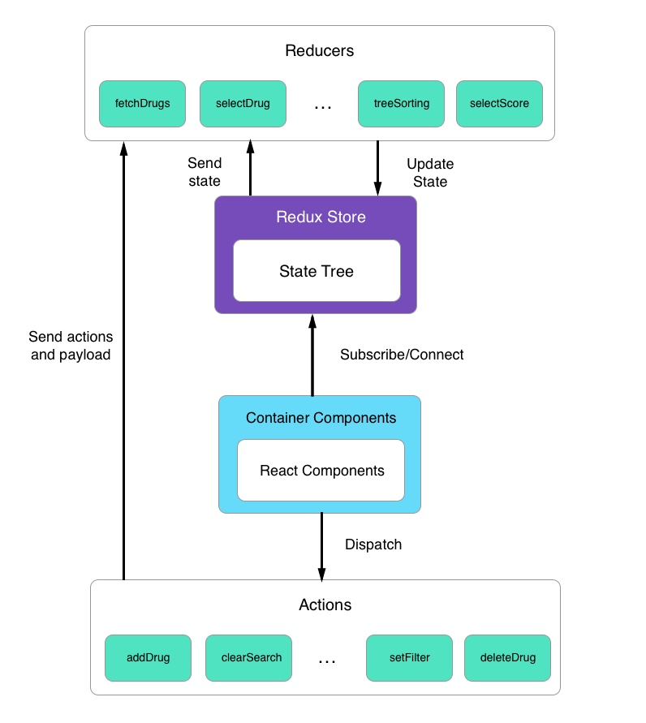
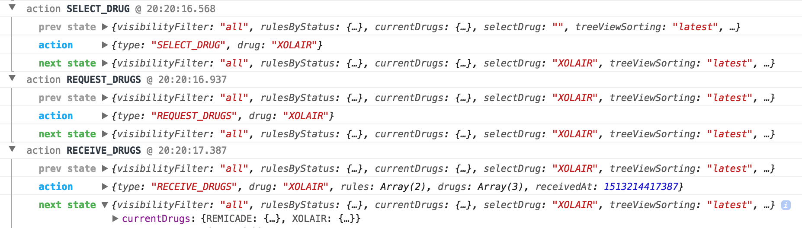
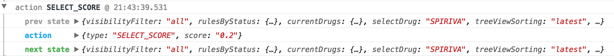
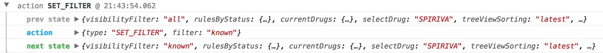

# MARAS/DIVA System Review and Creating MIAP

The individual MARAS and DIVA tools relied on each other to be useful for
analysis by FDA evaluators, our target use case for this project. DIVA requires
data showing the drug interactions in order to create meaningful 
visualizations and MARAS, despite filtering and ranking the initial FAERS 
reports to focus on the interactions, creates far too much data to be able to 
effectively analyze without support from a visual interface. Thus it was
vital that they be unified into a single system, which we called MIAP, the 
Multiple-drug Interaction Analytics Platform. The first phase of our project
was to unify the tools, as they currently existed, into a single toolchain.

In order to accomplish this, we divided that task into two parts. Firstly,
we reviewed the current codebase of both projects in order to decide on the
cleanest way to integrate them. This involved a line-by-line reading of both
systems. Then we refactored each project to be more maintainable, using published
libraries, reducing the number of programming languages required, and focusing
on applying standard software engineering practices to the development of each
program. In essence, we rewrote each tool from scratch to ensure that they would
work in concert without human intervention.

## Analysis of Existing MARAS and DIVA Systems

In order to learn how the preexisting DIVA and MARAS systems functioned, the
team decided to split the code up and perform in-depth analysis of the code
and its functions. This decision was made because the preexisting code had
little documentation and was difficult to understand without tracing the
actions of the code line-by-line. Therefore, as part of the Deep Dive process,
the team generated documentation to improve the code's readability and
facilitate future efforts to refactor the code.

As the MARAS codebase was written in two languages (JAVA and C++), we divided
the code review into two subtasks---one for analyzing the JAVA codebase,
focusing on data transformation and score calculation, and the other
concentrating on the C++ code for mining frequent itemsets and association
rules. The two code-bases only interacted by reading the files created
by the other applications and this lack of logical interactions between the
two sections of the existing code made this division of labor sensible.

The codebase was further divided into 4 separately executed steps:
Preprocessing, Rule Mining, Closure Generation, and Score calculation. These
correspond to the four steps specified in
[@Sec:maras]. The rule mining step was
performed in C++, while the other three steps used JAVA code only.

The JAVA code was built around three main objects: `Itemset`, `Rule`, and
`Group`. It also includes three executable classes: `Preprocess`, `ProcessFI`,
and `Explorer`. As a whole, while there was no documentation, either inline,
or at a JAVAdoc level, this module was fairly straightforward to analyze.

Of the three executable classes, `Preprocess` was the only one which did not
interface with the data objects. After reading in the database of Adverse
Drug Reactions, it created three files. The first two files were a unique
mapping of the drugs and reactions referenced in the database. The third
file applied that mapping to the database to create a list of reports where
each report was made of the unique identifiers for each drug and reaction.

These unique identifiers are shared between drugs and reactions. For
example, `Preprocessor` might map the drugs "Aspirin" to a unique ID of 1521 and
"Excedrin" to a unique ID of 141, while mapping the reactions "Headache" and
"Nausea" to 35413 and 33899, respectively. This would take a report line from
the following format:

```
"Aspirin","Excedrin"	"Headache","Nausea"
```

The line would be output in the following format for consumption by the
C++ data mining codebase, which operates using numerical itemsets.

```
1521 141 35413 33899
```

As shown above, this removes the indication that the drugs and reactions
are different objects in the data. This was a particularly poorly documented
detail of the process.

The C++ code in the existing MARAS system was used to generate frequent 
itemsets from the FAERS reports and output association rules that might 
indicate a causal relationship linking a set of drugs to one or more adverse
reactions. The code uses the FP-Growth algorithm for frequent itemset 
generation.

Through completion of the C++ Deep Dive, many issues were discovered with the
existing code. To begin with, there was barely any in-code documentation. This
problem was fixed by adding Doxygen-style comments to describe each function
and each class. There were also a number of redundant data structures defined
in the C++ code that were also defined in the Java code. This problem raised 
the question of the feasibility of modifying the sections of code written in 
C++ or Java so that they are both in the same programming language and 
redundant data structures can be eliminated. Additionally, parameters such as
the minimum support and the minimum confidence were both hard-coded constants.
While this may work for testing or experimentation purposes, in reality users
may want to specify these parameters to customize their results.

{#fig:cpp-diagram width=100%}

This figure shows the class diagram for the existing C++ code. Upon examination, 
it is evident that many of the classes represented in C++ are also represented
in Java, leading to inevitable redundancies.

The results from the C++ code were used by the `ProcessFI` section of the JAVA
code to populate a list of `Itemset` objects, where each different itemset length
is organized together. It also populated a collection of `Rule` objects
with the rules mine in the C++ code. These Itemsets were then filtered to create
closures, using a method defined in `ProcessFI` and rules were further filtered
to only be associated with Closed Itemsets. Additional filtering ensured that
no rules originate with reactions.

The `ProcessFI` executable would output files containing each filtered rule,
as well as all the closed itemsets. These files are then read in by the 
`Explorer` executable, which creates a `Group` objects. Each group object
associates a closed rule with its component subrules (found from the
unfiltered rule-sets). These are used to calculate the score by the process
outlined in [@Sec:maras].

The D3 Visualization code produces the DIVA views described in [@Sec:diva-methodology]. 
This code takes data produced by the Java rule-mining application and creates
the resulting Overview, Galaxy View, Profile View, and Reports View. The 
Deep-Dive process for this code included the creation of comprehensive
documentation using JSDoc, a Doxygen-style documentation system for Javascript
code. By using JSDoc-style comments, each function could be annotated to
describe its functionality and parameter values. This documentation can output
HTML web pages that provide a quick overview of the organizational structure
of the software, along with easy access to details on each function. In
addition to documentation, the D3 Deep Dive involved changes to the coding
style for consistency, including fixes to indentation, spacing and comments.

The SQL code in the MARAS system performs a variety of data manipulation and 
parsing functions which enable the MARAS system to utilize FAERS report data. 
First, the SQL code contains functionality to parse FAERS report data from a
`.txt` file format and construct corresponding SQL databases populated from that 
data. This code collects data on both drugs and reactions and combines them 
into a single table that contains only the information required by the MARAS 
system. There are separate functions to handle FAERS data from before 2015 and 
to handle the data from 2015 and beyond, because the format of the FAERS data 
changed slightly in 2015.

Second, the code includes functionality to connect rules mined by the MARAS 
system to the FAERS reports that the rules are generated from; for example, if 
MARAS discovered a rule stating that taking Advil and Warfarin together caused 
bleeding, this function would create a list of all of the reports that 
contained Advil and Warfarin in the drugs and bleeding in the reactions. This 
behavior is necessary to create the Reports View of the DIVA application. 

When examining the SQL code, we considered several refactoring changes that 
could improve the usability and maintainability of the system as a whole. The 
codebase contains some functionality that could be accomplished equally 
effectively in Java, using APIs like JDBC. This would allow us to further 
centralize our code by keeping as much functionality in one language, and in 
one system, as possible.

To run the original MARAS system from start to finish, the user had to 
manually execute each step of the program. These steps included: 
pre-processing (Java), data mining (C++), finding closures (Java), and
generating results (Java). At the beginning and end of each of these steps,
the program would read from or write to disk in order to allow the program to
pick up from where it left off in the previous step. This combination of
excessive file I/O and an unnecessary reliance on user intervention made
running the system unnecessarily complicated.

{#fig:intermediate-files width=100%}

This figure shows all of the files that are created to use during intermediate
steps between the initial input and result generation. Following the program
execution, these files are largely of no use to the user, other than possibly
for debugging purposes.


## JAVA Refactoring

Following the Java and C++ Deep Dives, the team discussed options for going 
forward. It was clear from the Deep Dives that the MARAS program should be 
modified to operate entirely in memory as a one-step process. This would make 
running the MARAS much simpler and make the process of integrating the MARAS 
system into the client-server architecture easier in the future.

Another major decision was whether or not to translate the C++ code into Java. 
In the end, the benefits of having all the code in one language outweighed the 
costs of rewriting that section of the MARAS system. This decision would make 
future maintenance of the system a much easier task, allow for the elimination 
of redundant data structures, and allow for a more natural one-step program 
flow that did not rely on file I/O to go between intermediate steps.

For the first iteration of refactoring the Java code, we decided to keep the 
underlying structure of the code as consistent as possible with the previous 
version while making modifications so that it ran entirely in memory. By 
minimizing the scale of the changes being made, we hoped to quickly produce a 
functioning prototype of the MARAS system that could be run on the server. 
Also in this revision of the code, we found and integrated Java 
implementations of the FP-Growth algorithm for frequent itemset generation and 
an association rule mining algorithm. The Java implementations of these 
algorithms were part of the SPMF Library put together by Philippe Fournier-Viger [@pfv].

After successfully refactoring three of the original four parts of the MARAS 
system to execute only in memory, it became apparent that the current program 
structure was insufficient. For one thing, the program did not take advantage 
of Java's object-oriented design principles, lacking much encapsulation. 
Instead, the existing code relied on frequent parsing of input files into 
objects, with most of the code operating on that object living outside of the 
object's class. Therefore, to improve the program's logical flow and make it 
more maintainable in the future, the team decided to refactor the MARAS system 
from the ground up, embracing the object-oriented design style to make the 
program flow more meaningful and readable.

Since we used new implementations of the algorithms for frequent itemset
generation and association rule mining, we tested to ensure that both frequent
itemset generation algorithms produced the same results given the same input 
and parameters and likewise for the association rule mining algorithms. To 
perform the test, both frequent itemset generation implementations were given 
the same transaction database as input and their minimum supports were both 
set to 10. Then, an output file was generated by both algorithms. These files 
were compared to test that they contained the same itemsets, regardless of 
itemset order or the order of items within the itemset. Similarly, the 
association rule mining implementations were both given the same set of 
frequent itemsets, a minimum support of 10, and a minimum confidence of 0. 
After receiving output files from both algorithms, they were compared to 
ensure that each algorithm produced the same rules with the same supports and 
confidence levels, disregarding the location of rules within the file or items 
within the antecedent or consequent of a rule. As a result of this testing, 
the team confirmed that both algorithms produced equivalent results, 
indicating that the Java implementations had been successfully integrated into 
the program.

{#fig:itemset-rule-testing width=100%}

For the second Java refactor, the team split the work into four distinct 
sections to reduce the time taken to perform the refactoring. The main idea of 
this refactor was to preserve encapsulation wherever possible, meaning that 
much of the existing code could be reused, but was moved within the class that 
it manipulated. Therefore, a set of rules could find its closure or filter out 
invalid rules, rather than performing these functions externally. The result 
of this refactor was a much simpler, more readable program flow. It was 
obvious which objects were involved in each step and what actions were being 
performed because the objects involved in the program's execution are well 
labelled and methods with descriptive names are called on the objects to
perform any action.

{#fig:framework width=100%}

## Client-Server Setup

Our team's overall goal of the Client-Server setup process was to:

*   Build a full-stack web application mainly for visualizing the data,
    providing a native-application-like user experience and supporting
    rich interactions with multiple components on the page.
*   Easy to setup with minimal configuration for local development and
    remote deployment.
*   Modular so that different members in the team were able to work on
    different parts.
*   Maintainable in order to continue to work productively as the 
    application grew in functionality and complexity.
*   Reliable in order to work correctly and avoid unpredictable
    behaviors.

### Server-side Stack

We chose **NodeJS** [@node18] as the runtime environment and **ExpressJS** [@express17] 
as our main back-end framework. There were two main reasons we used NodeJS. First, NodeJS
uses Javascript as its main programming language. Therefore, by using NodeJS,
we only had to program in one language across the front-end and back-end.
Second, NodeJS is supported and backed by very active open-source community.
Hundreds of thousands of packages and modules developed by the community are
being hosted on **NPM** [@npm], the main package and dependency manager for NodeJS.
ExpressJS is the most popular web micro-framework in the NodeJS community.
It is fast, small and does not do much by itself. However, we could pull a
lot of open-source modules in an Express application to make it useful and
functional. Using NodeJS and ExpressJS as the foundation of the server
fulfills the system's second goal. It is easy to build and start NodeJS
server by running a few commands and setting environment variables.

We used **TypeScript** [@typescript17], an extension of Javascript as our main programming
language of the server. It is completely backward compatible with JavaScript
but provides nice object-oriented features such as classes and interfaces,
and optional static type. The main benefit of using TypeScript is that it
enables different Integrated Development Environments (IDEs) to provide extra
features such as autocompletion, errors checking, refactoring. Using
TypeScript allowed us to divide parts of the project into reusable and
maintainable modules, which achieved the third and fourth goals as the
project grew.

We used **Mocha** [@mocha18] and **Chai** [@chai] as the main testing framework and assertion
library. They are the most popular testing stack in NodeJS community and
proved to work well together. By writing tests and doing Test Driven
Development (TDD), we were confident that every feature worked as we expected
and not worried that refactoring or adding new features would break the code
somewhere else. This fulfills the reliability goal of the system.

The server for this project served as a resource server for the client
application. It provided different endpoints that allowed the client
application to do basic REST operations such as reading, creating, updating
and deleting on different resources. In order to do this, the ExpressJS server
routing and middleware systems provided a set of API to handle the client's
HTTP requests. In this project, requests to read or retrieve the data were
important because this allowed the client to get the data, analyze and
visualize the information to the end users. For example, the client
application could send a `GET` request to `/drugs/` to retrieve all records or
`/drugs/{drugname}` to get all the records related to that specific drug.

{#fig:server width=100%}

The Java data mining program was a submodule and ran in the NodeJS web server.
Whenever the authorized user posts a new data file to the server, the server
will process the input file with Java program and generate new output files
for data visualization. The server also had a command-line interface to import
the data files and run the Java program manually.


### Client-side Stack

#### React

The Client-side stack fulfills the first and the most important goal of this 
project. We used *ReactJS* as the main front-end framework for building the 
interface of the application. It allowed us to build different components 
that we can reuse, which have their own HTML templates, behaviors and states. 
The components can be put together and interact with other components by 
sharing the state to make an interactive and native-app-like website. 

#### Material UI

As mentioned above, one main advantage of using a modern Front-end framework like React is the ability to use third-party components and reuse components that we create. For the layouts and styling of the website, we exclusively used React components implementing Google’s Material Design. By using these components, we can easily create a basic layout containing the navigation bar, sidebar, different panes, text fields, buttons and so on. These components have default style rules, but we are free to override them. We can also attach event listeners to the components to make them interactive. Utilizing third-party components helps us focus more on the logic and behavior than on the styling and animation of the website while still keeping the application aesthetic.

#### Redux

Redux is a small state-management library that works well with React applications. It has a single store that stores all the current states of the applications. The idea behind Redux is simple: a React component (or any other kinds of component) emits a Redux action, which is a Javascript object that describes what happened. When receiving the action, the store singleton will decide how to change the state tree based on the reducers that you implement. Then, any components in the application that subscribe to the state change in the store will re-render themselves to reflect the change to the user. @Fig:redux briefly shows how React and Redux work together. Redux helps the application behave consistently and avoid bugs. It also makes the application scalable because when the application grows bigger and more states need to be controlled and shared among many components, Redux can manage all those states perfectly by creating more actions and reducers.

{#fig:redux width=100%}

In the new DIVA application, Redux state management connects different components and their states. In @Fig:log, the Redux logging system shows different actions emitted by React components when the user clicks on a node in the Overview view. The store updates its state’s property “selectDrug” to the selected node’s drug name. It also requests the rules related to that drug from the server by the `REQUEST_DRUGS` action. When the `RECEIVE_DRUGS` action is emitted with the payload fetched from the server, the store updates its state’s property `currentDrugs` by adding new drug rules related to that drug. The Galaxy View and Profile View, both of which subscribe to the state changes, will re-render themselves. The Galaxy View listens to the changes in the `currentDrugs` property in the state tree and renders a new graph corresponding to the recently added drug rules. When the Profile View sees changes to the `selectDrug` property, it will re-render and show the profile for the new drug. Redux also makes it easy to implement global filters and searching, simply by adding the filter states to the store. Those filters can be applied to all components that subscribe to the Redux store. [@Fig:score;@Fig:filter] shows actions related to updating the filter state.

{#fig:log width=100%}

{#fig:score width=100%}

{#fig:filter width=100%}

