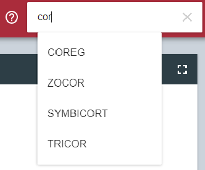

# Improving the MIAP Platform

After refactoring the existing MARAS code and DIVA visualization and creating
our initial version of MIAP, it was time to begin adding in new features to meet
the needs of a more complete integration of the two sides of the application.

We focused on four areas: 

*    Collective Data Mining for processing new input files
     when they arrive, in concert with the data already available for MARAS to
     analyze. This also includes integrating some of the preprocessing
     we did on the FAERS data to be able to read it into the MARAS program
     with less user intervention.
*    Adverse Reaction Mapping to ensure that standard names and descriptors
     are used in reporting of the adverse reactions tied to FAERS reports,
     which ensures that known adverse reactions are matched whenever they
     occur.
*    Drug Name Mapping to ensure that there is a standard vocabulary of drug
     names that prevents trivially different reports from being parsed as
     different drugs.
*    Further improvements---refactoring and restyling---to the web interface
     to bring it up to a professional standard of usability and appearance.

## SQL Refactoring and Collective Data Mining

Once the Java and C++ code of MARAS was successfully combined, we next worked on 
refactoring the SQL code that organizes and filters the raw FAERS data to get 
specifically the data that the MARAS system will use. Just as with the C++ 
code, we determined that it would be most effective to replicate the SQL 
code’s functionality in Java; this would allow us to keep all of the MARAS 
code in one language, and all of the functionality would be contained in a 
single executable. 

The process of parsing FAERS data evolved through multiple phases. First, 
the Java program was modified to take 3 file paths as input, corresponding 
to the three FAERS files MARAS uses: the drugs file (e.g. `DRUG17Q2.txt`), 
the reactions file (e.g. `REAC17Q2.txt`), and the demographics file (e.g. 
`DEMO17Q2.txt`). The program parses these three files to compile the data 
into Report objects, consisting of a list of drugs and a list of reactions; 
these reports are used by the Association Rule Mining algorithm to calculate 
the resulting rules.

The FAERS files are structured such that each line refers to a data point for 
a given FAERS report. For the drugs file, each line contains the ID of the 
report, the name of the drug, and additional information not used by the MARAS 
system, such as the dosage. If a given FAERS report contained 5 drugs, the 
resulting drug file would contain 5 lines, each representing one of those 
drugs and referring to the same report ID. Similarly, each line of the 
reactions file contains the ID of the report and the reaction experienced, 
and each line of the demographics file contains the ID of the report and a 
set of demographic information about that report. The MARAS system 
specifically examines expedited reports, which are distinguished in the 
demographic file as “EXP”. 

To handle this data, the MARAS system must search through each of these files 
and match the lines according to their Report IDs. The result is a list of 
drugs, reactions, and demographic information that make up a complete report. 
From there, the system can filter out reports that are not expedited, and 
create Report objects from the drugs and reactions that can be used by the 
Association Rule Mining code.

After this change was implemented, we determined that it would be easier if 
the program directly uses the FAERS data as it is downloaded from the FDA’s 
website: a .zip file containing a number of different files and folders, 
beyond just the three that the MARAS system uses. We refactored the input to 
now take in a single .zip file; it then extracts the files from this zipped 
folder and searches for the three relevant files, then runs the analysis on 
those files as before. This makes the command-line arguments for the file 
simpler, and reduces the amount of work that must be completed before running 
the MARAS code. 

While this functionality was effective for mining rules from a single set of 
FAERS data files, which are organized by year and quarter (such as 2017 Q2), 
it did not allow us to find rules from the combination of multiple sets of 
FAERS data. Therefore, the next step in refactoring would be to support 
cumulatively analyzing sets of FAERS data in conjunction with the data 
already used. In order to accomplish this, the MARAS program saves the three 
FAERS files extracted from the zipped folder in a data directory, then parses
all of the files in that directory into the Report objects. Therefore, when 
the user passes a zipped FAERS folder to the MARAS system, the data is added 
from that folder to the collection of data it has already been given, and 
then generates the ruleset with this new data included. This allows the 
system to generate rules based on any number of FAERS datasets collectively, 
as opposed to a single FAERS dataset at a time.

This setup successfully meets the goal of allowing the MARAS system to utilize
multiple sets of data from FAERS, but it had a significant problem: repeatedly 
parsing the files is inefficient, and as more and more datasets are added the 
system took exponentially long to run. Indeed, even running the system on just 
two datasets, the 2013 Q1 and the 2017 Q2 data, took well over an hour to 
complete. Therefore it was important to find any way we could speed up this 
process; namely, by reducing the repeated work done each time the system ran.

The clearest candidate of repeated work that could be eliminated is the 
process of parsing the raw FAERS text files. Each raw file contains a 
significant amount of data, much of which is ignored by the MARAS system. 
This resulted in a significant time cost that could be avoided by cutting out 
as much unnecessary data as possible. We determined the most effective method 
for this would be to store the parsed data in a new format after organizing 
the information into a set of Reports; when the system runs, rather than 
parsing the raw data over again, it will parse the new format that contains 
just the information it needs. The format we used is a text file where each 
line represents a report; each line contains a list of drug names and 
reaction names, with an arrow symbol “->” in between to distinguish them. 
Additionally, each drug or reaction name is separated by a comma. This results 
in concise data that only stores the information needed by the system. This 
dramatically reduced the size of the data being parsed; while the raw FAERS 
files for 2017 Q2 combined were almost 200 MB of data, the simplified file for 
that same data was just 16.5 MB. The results were also clear in terms of the 
time the system took; whereas running the system on the 2013 Q1 and 2017 Q2 
data took over an hour before the change, after the change it took around 12 
minutes from start to finish. 

Next, there were several steps that made the MARAS system more efficient and 
simpler to use. First, the command line argument format was refactored to 
emphasize simplicity and flexibility. While the first version of the MARAS 
system simply defined command line arguments based on the order of the arguments
(the first argument was the FAERS file, the second argument was the output path,
etc.), the new version used specific flags to indicate which argument was which,
such as “-f” to indicate the FAERS file(s) used and “-o” to indicate the output
path. This meant the user would not have to memorize the order of the arguments,
and also allowed for more flexibility for certain parameters. For example, under
this format the MARAS system supports the input of multiple FAERS files at a 
time, which provides greater flexibility.


## Adverse Reaction Mapping
One important component of the DIVA/MARAS system is the ability to label 
potential drug-drug interactions that are mined from FAERS data as *known* or 
*unknown*. A drug-drug interaction is labeled as *known* if the interaction has 
been previously documented. Otherwise the rule is labeled as *unknown*. This 
labeling process is important because it allows FDA analysts to filter out 
interactions in the DIVA visualization that correspond to known drug-drug 
interactions so that they can instead focus on discovering novel ADRs.
 
After researching sources of known drug-drug interactions, the team considered 
two potential sources: Twosides and a RESTful API that draws information from 
the ONCHigh and Drugbank databases (@Tatonetti2012, @DRUG_INTERACTION_API). 
Twosides is a database available as a file download that contains simple known 
drug-drug interaction rules, each rule consisting of two drugs and one adverse 
reaction. Meanwhile, the RESTful API takes as input the name of a drug and 
provides information about any known interactions with other drugs. However, 
the problem with the reaction information obtained via the RESTful API is that 
it provides a general description of the ADR, rather than a descriptive term 
such as those found in the FAERS reports and the MARAS rules. For example, for 
the reaction between Vincristine and Cyclophosphamide the RESTful API 
describes the ADR as "The serum concentration of Vincristine can be increased 
when it is combined with Cyclophosphamide", whereas corresponding Twosides and 
MARAS rules label the ADR as Anemia. Therefore, the RESTful API could not 
easily be used to decide whether a given MARAS rule is known or unknown due to 
this difference in the method of describing ADRs. For this reason, the team 
chose to use the Twosides database for the purpose of identifying known drug-
drug interactions.
 
After finding this source for known drug-drug interactions, there were still
problems with matching the drug-drug interaction rules found in the MARAS
system with the known rules from the Twosides database. The main issue was
that the names of ADRs in the Twosides database did not always match up with
the names of ADRs used by the FDA in the FAERS data. This meant that there
were rules mined by the MARAS system that were equivalent to rules found in
the Twosides database of known drug-drug interactions but were not matched
because the term used to describe the MARAS rule's ADR was a synonym for the
term used to describe the Twosides rule's ADR. Consider the following example.
The MARAS system mines the rule that states that Aspirin, when used in
conjunction with Metoprolol, causes Myocardial Infarction. Meanwhile, a
similar rule in the Twosides database states that Aspirin, when used in
conjunction with Metoprolol, causes Heart Attack. While these two rules are
equivalent in meaning, the MARAS system failed to label the MARAS rule as
known since the ADR names were different. This problem supported the need for
ADR name standardization between the known rules in the Twosides database and
the rules mined from the FDA's FAERS data.
 
The MedDRA hierarchy is a commonly used form of classifying and grouping
related terms for ADRs (@MEDDRA). The hierarchy is organized from most general
to most specific. The levels of the hierarchy are System Organ Class (SOC),
High Level Group Term (HLGT), High Level Term (HLT), Preferred Term (PT), and
Lowest Level Term (LLT).  LLTs are the most specific terms and describe how an 
observation is usually reported. Each LLT corresponds to only one PT, and each 
PT corresponds to at least one LLT. In addition, PTs can have synonyms. The 
next level of abstraction groups similar PTs under a single HLT, which are 
further abstracted into HLGTs. Lastly, HLGTs are grouped into SOCs by the 
cause of disease, area affected by the disease, or purpose.

The ADRs given in the FAERS reports are in MedDRA PTs [@FAERS]. However, the 
ADRs in the Twosides database are either in LLT or PT form. Therefore, there 
is a need to convert all ADRs to PTs and recognize when two or more PTs are 
synonyms. These are the principal goals of ADR name standardization in this 
context. However, it should also be noted that the proposed method of ADR 
standardization will also help to reduce the number of MARAS ADRs that are 
synonyms for one another, resulting in rules with higher support values that 
more accurately reflect the importance of the drug-drug interaction.
 
When researching methods of ADR name standardization, the team first 
discovered the SIDER database, which contains mappings from Lowest Level Terms to
Preferred Terms that are extracted from drug labels @Kuhn2016. To leverage 
this database for name standardization, each mapping was read in, using 
the process seen in @fig:sider-map-creation, to attempt to create ADR schemas 
corresponding to each distinct ADR. Each ADR schema has at least one LLT, at
least one PT, and a standardized name (made up of the concatenation of all 
PTs in alphabetical order). An example of such an ADR schema can be seen in
@fig:adr-schema; the Lowest Level Term arthritis has two Preferred Terms,
arthritis and rheumatoid arthritis, and the standardized name
"arthritisrehumatoidarthritis". Then, when an ADR term was read in, either from the 
FAERS data or the known rules, the term was checked against each ADR schema to 
see if it matched any of the LLTs or PTs of that ADR. If a match was found, 
then, as in @fig:sider-map-chart, the ADR term was changed to the 
standardized name from that ADR schema to be used in the subsequent steps of 
the MARAS system.

{#fig:sider-map-creation width=100%}

{#fig:adr-schema width=100%}

{#fig:sider-map-chart width=100%}

While the number of rules labeled as known by the MARAS system increased, 
the system still failed to recognize that Heart Attack is the same ADR 
as Myocardial Infarction (@Fig:sider-problem), signifying that 
the SIDER database was incomplete in its mapping database from LLTs to PTs. 
Therefore, an alternative source of ADR name standardization, MetaMap, was 
explored.

{#fig:sider-problem width=100%}

MetaMap is a tool provided by the National Library of Medicine that parses 
natural language and identifies Unified Medical Language System concepts from
the text (@Aronson2010, @UMLS). To implement MetaMap into the MARAS system, 
every time an ADR term was read in from the FAERS data or the known rules,
the term was checked against a "cached" map of all ADR name conversions
that were previously made by MetaMap. This process can be seen in 
@Fig:metamap-process. In the event that the ADR term had not previously been 
converted with MetaMap, the term was submitted to MetaMap and the resulting
PTs were concatenated to form a single standardized term for the ADR. This
standardized term was then added to the map of "cached" terms to reduce
future look-up times. An example of a mapping using MetaMap can be seen in
@Fig:metamap-example.

{#fig:metamap-process width=100%}

{#fig:metamap-example width=100%}

After implementing both methods of ADR name standardization, a comparison, 
seen in @Fig:metamap-solution, was done on the effect of each 
method on the MARAS process. Using the SIDER ADR hierarchy, the MARAS system 
detected 7657 distinct ADRs, whereas 7724 distinct ADRs were detected when 
using MetaMap. This may mean that the MetaMap system does not generalize as 
well as the SIDER ADR hierarchy. Despite appearing to exhibit less 
generalization, MetaMap outperformed SIDER at matching MARAS rules with 
equivalent known rules, finding 56 known rules out of 1542 while the 
SIDER-based system found only 13. In addition, the set of 13 rules labeled 
known by the SIDER-based system was a subset of the 56 rules found by the 
MetaMap-based system. It is also worth noting that the MetaMap-based system 
succeeded in recognizing that Heart Attack is a synonym for Myocardial 
Infarction, resulting in more rules being labeled as known, such as the rule 
in @Fig:metamap-solution. As another part of the comparison, the time was 
measured during the process of standardizing the ADR terms for each of the 
known rules using both methods. A further experiment was conducted to measure 
the time taken to process the rules with and without parallelization for each
method, as seen in @tbl:adrmap. Without parallelization, the MetaMap-based method took 38 minutes to 
process the known rule database while the SIDER-based method took 45 minutes. 
With parallelization, the MetaMap-based method took 8.3 minutes to process the 
known rule database while the SIDER-based method took 8.6 minutes. Overall,
the team decided that the MetaMap-based approach was a better match for the 
MARAS system because it not only provided for better known rule matching but 
also outperformed the SIDER-based approach in terms of time efficiency.

{#fig:metamap-solution width=100%}

| | MetaMap | SIDER ADR Hierarchy |
|:-|:-:|:-:|
| \# of distinct ADRs | 7724 | 7657 |
| \# of rules labeled as Known | 56 | 13 |
| Time to parse known rules | $\approx8.3$ minutes | $\approx 8.6$ minutes |
| Time to parse before parallelization | $\approx38$ minutes | $\approx45$ minutes |

: Comparison of effectiveness and speed of ADR mapping methods. {#tbl:adrmap}

Once MetaMap was chosen as the engine for adverse reaction mapping, we 
integrated not just the calls to the Metamap API, but also the operations of the
MetaMap server. To successfully 
utilize the MetaMap API, MARAS uses three separate server instances: the 
SKR/Medpost Tagger, the Word Sense Disambiguation (WSD) Server, and finally the 
actual MetaMap server itself. Originally, this required manually starting these 
three separate server instances in different windows or as background processes, 
and then manually closing these instances when they are no longer needed. To 
improve simplicity and usability, this process was instead integrated as part of 
the MARAS system itself. The program starts the three separate server instances 
on its own, and closes them once the analysis is completed. This reduces the 
overhead required by the user to start the system, and makes the MARAS-DIVA 
integration simpler.

Finally, the MARAS system had to be deployed to our server, set up through WPI. 
Because the server is run through a Linux system, and our testing up to this 
point was performed on Windows systems, the first step required to integrate to 
the server was to handle Linux support. This primarily involved refactoring to 
properly support the Linux version of MetaMap; the MARAS system will detect 
which operating system is being used and launch the proper MetaMap instances
appropriately.

## Drug Name Matching

When parsing the input data in order begin preprocessing it for
mining in our MARAS tool, we found that we had many similar drug
names in our input fields, where a human would often be able to
recognize as belonging to the same drug. However, in these situations
the association-rule mining algorithms would end up treating them
as different drugs, as their names wouldn't pass na&iuml;ve equality
checks. In order to accomplish this, our algorithms must consider
a 'fuzzy' notion of equality.

This notion is often used in name lookups for people---as it is easy
to misspell someone's name, especially in international settings. In
their master's thesis, @du2005approximate, explored the effectiveness
of various algorithms for matching similar personal names. They found
that for language independent name matching, algorithms based on
**edit distance**. gave the most effective results.

Edit Distance
:   Given two strings $a$ and $b$ on an alphabet $\Sigma$ (for
    example, the set of ASCII characters), the edit distance
    $\mathsf{d}(a,b)$ is the minimum-weight series of edit operations
    that transforms $a$ into $b$.
:   Less formally, edit distance is the number of simple edits required
    to transform one string into another. The different operation 
    classified as simple edits are the substitution of a letter, deletion
    of a letter, insertion of a letter, and the transposition of two 
    adjacent letters (@du2005approximate pp. 5).

    The smaller the edit distance between two strings, the more similar
    each string is to the other.

When using edit distance algorithms to correct misspellings of surnames across 
multiple cultures, @du2005approximate found that there was a tradeoff between speed
and maximizing the number of relevant matches. They found that using
a Bloom Filter and reverse edit distance would minimize the number of
irrelevant matches while running faster, while using edit distance 
with a trie data structure and constant first letter would maximize the
number of relevant matches at the expense of speed.

This sounds like it would work pretty well for our usage. While we are
unlikely to encounter misspellings, the data we get from FAERS can often
contain extra information, like the active ingredient in addition to the
name, the dosage information, or even just a repeat of the drug names
themselves.

However, in order to have anything to match, we need to have a database
of normalized drug names---a set of drugs that we match everything back
to. The main difficulty here is developing a vocabulary of drugs that
is sufficiently large and will almost always contain the drug that was
meant in the report. For this purpose, we are using RxNorm, a dataset of all 
perscribable drugs managed by the National Library of Medicine (@liu2005rxnorm).

In order for accurate sorting of the imperfect names in the ADR reports
we need to have a dataset that includes almost all named drugs without having
too many overlapping names. Unfortunately, with RxNorm
there were many overlapping names in even the smallest dataset provided, as the
dataset provides some mapping functionality between different formats for
each drug.

Thus, we had to further clean the dataset in order to make full use of it for
drug name matching. For the first iteration of dataset cleaning, we used
a script to create a JSON datafile that contained only drug names that didn't
have another dataset entry with a name that was a substring of it's name.

For example, if there was `injectablediazepam` as well as `diazepam`, we'd only
want to include `diazepam`. To accomplish this the following python loop
was executed for every new drug name read into the script.

```{#lst:vocab-builder .python caption="Naive Vocabulary Building"}
flag = True
for drug_id in output_dict.keys():
    drug = output_dict[drug_id]
    if name in drug:
        flag = False
        break;
    if drug in name:
        output_dict.pop(drug_id)
if flag:
    output_dict[nId] = name

```

This is just a naive check to see if our dictionary of drugs (and id's) either
contains another drug whose name is fully contained within the current drug's
name---which means we ignore this new drug---or if drugs we already added to
the dictionary fully contain the current drug name, whereupon we remove those
drugs from the dictionary and keep checking more drugs.

Of course, this makes parsing the dataset a very computationally expensive
process, being $O(n^2)$ and having to process more than 200,000 lines. In
initial testing, this takes almost an hour. Fortunately, once the dataset is 
satisfactorily cleaned, the drug list will not have to be recalculated for
quite a while.

Unfortunately, this didn't do quite enough to remove redundancies in the
dataset. This algorithm left overly-specific entries such as the following:

```
1003676: 'zerit15mgoralcapsule',
1003680: 'zerit20mgoralcapsule',
1003684: 'zerit30mgoralcapsule',
1003688: 'zerit40mgoralcapsule'
```

: Vocabulary Sample Showing Redundancy from Dosage Information {#lst:vocab-dose}

A human user would reduce such drugs to `'zerit'`, leaving off the dosage
information, but since there wasn't necessarily an entry in the dataset
merely saying `'zerit'`, the entries were never shortened.

Thus, we worked on creating a dictionary of strings that could be (mostly)
safely ignored when parsing the drug names. This included words like
`oral`, and `injectable`, but also numbers, units, or body part descriptors
such as `vaginal`, `subcutaneous`. Because we aggressively removed matching
character sequences from our potential drug names, we had to be sure that
the patterns we were using wouldn't match unintended words. For example, 
without special treatment, the pattern `in` would match the final two
characters in the word `protein`, which was undesirable. Thus, we made the
pattern `' in '`, which would only match with whole words.

Additionally, drugs would often be of the form:

```
3858048: 'd4t30mgoralcapsule[zerit]',
3858049: 'dht30mgoralcapsule[zerit]',
3858259: 'd4t20mgoralcapsule[zerit]',
3858260: 'dht20mgoralcapsule[zerit]'
```

: Vocabulary Sample Showing Redundancy from Alternate Forms {#lst:vocab-alt}

This is an easy special case, since we can just find the string inside
the square brackets and reduce our result to `zerit`, which is our goal.

Once we developed this vocabulary, we can run the edit distance on all members
of the vocabulary for a matchable drug name. Consider the following example vocabulary:

```
vicodin
zamicet
ibuprofen
theophylline
```

: Sample Vocabulary for Edit Distance Example {#lst:vocab-edit}

If we are attempting to match `IBUPROFEN 500mg`, then the process would be to
first perform the same normalization step as we did with the strings in the
dataset: removing whitespace and converting to lowercase. Thus,
`IBUPROFEN 500mg` becomes `ibuprofen500mg`. Then we calculate the edit distance
for each of the strings in our vocabulary. 

At first, we considered pure Levenschtein Distance, which is an edit distance
involving only the substitution, insertion or deletion of single letters.
We modified the cost of substitution to be the same as an insertion followed by
a deletion, otherwise all words of the same length and no overlapping letters
would be just as far away as a word that contains every letter in the source
string, but is twice as long.

The evaluation methodoloy we used to test this distance was implemented in JAVA by
@allison99edit. For example if we run `ibuprofen500mg`, we get edit distances
of:

* `ibuprofen500mg -> vicodin`: 15
* `ibuprofen500mg -> zamicet`: 17
* `ibuprofen500mg -> ibuprofen`: 5
* `ibuprofen500mg -> theophylline`: 22

We also considered a second distance metric, namely the Damerau-Levenschtein distance,
which adds the ability to swap adjacent characters. This operation needs to
have a cost of at least half the sum of the costs of addition and deletion for
the algorithm we found, implemented by Kevin Stern in 2014. We chose
a cost of 1.2 as an initial test. For this metric,
we get edit distances of:

* `ibuprofen500mg -> vicodin`: 15
* `ibuprofen500mg -> zamicet`: 17
* `ibuprofen500mg -> ibuprofen`: 5
* `ibuprofen500mg -> theophylline`: 19.4

In our example vocabulary, both algorithms come up with `ibuprofen` as the best
match by far, which is good.

We ran this algorithm on the first 20,000 reports in our data set and tuned 
Damerau-Levenschtein distance parameters to attempt to maximize the number
of distinct drugs mapped. We ended up with approximately 8500 distinct drugs
matched in the first 20,000 reports using the following parameters:

* Add a character: 0.6
* Delete a character: 1.0
* Replace A character (add then delete): 2.0
* Swap two adjacent characters: 0.9


Once implemented and tuned, we needed to ensure that the behavior of our matching method
was reasonable and did not consistently match unrelated drugs. To this end, we
examined a random sample of the matched reports to document:

* The input name (e.g. `ibuprofen500mg`)
* The matched name (e.g. `ibuprofen`)
* The edit distance
* The number of times this mapping occurs

For example, a test sampling of 5 entries gave:

| Mapping Number | Input Name | Matched Name | Edit Distance | Count |
|---------------:|:-----------|:-------------|:-------------:|:---------:|
| 35498 | `inexium` | `nexium` | 1.0 | 27 |
| 515084 | `carvedilol` | `carvedilol` | 0.0 | 712 |
| 483937 | `metoject` | `totect` | 3.6 | 87 |
| 322073 | `metamucil` | `metamucil` | 0.0 | 45 |
| 397503 | `cyclosporine un` | `cyclosporine` | 4.0 | 2 |

: Table demonstrating evaluation sampling for Drug Name Matching {#tbl:drug-match}

The sensibility of a specific drug mapping is, however, a very domain-specific
problem. It, for example, it doesn't make much medical sense to map `metoject` to
`totect` as they are completely different drugs. Metoject is a cytotoxic 
antimetabolite used to treat severe arthritis, while Totect is a drug 
used to protect a patient's heart during chemotherapy for breast cancer.

Alternatively, INexium and Nexium are very close matches and are, in fact,
the same drug. So this is a sensible match. For evaluation, we manually
examined
both sides of the mapping to determine if the match is sensible or not.
However, not all sensible (or not sensible) mappings were created equal. It
is more valuable that all 712 occurrences of Carvedilol in the reports
were mapped correctly than that 45 occurrences of Metamucil were. Thus
we weighted the value of each sensible or not sensible mapping based
on how often they occurred.

Since we didn't want exceedingly common mappings like Carvedilol to
completely eclipse the more niche mappings we decided to compare the weights
of the square roots of the occurrences. This way the most common drugs are only
somewhat more important than those that happen just enough to contribute
to the rule lists.

In the above table, the four sensible matches (Inexium, Carvedilol, Metamucil, 
and Clyclosporine) contribute a weight of 40.0 to sensible matching,
while Metoject contributes a score of 9.3 to the not sensible matching.

Therefore this sample gets a score of $0.811$. Without the square-root weighting,
this corresponds to 94% of drug instances being matched sensibly.

For a larger sample, consisting of 100 mapping instances, we got a score of
0.842, corresponding to 86% of drug instances being matched sensibly.

We then tuned the weights of the algorithm to try to maximize the effectiveness
of our matching techniques. In the end, after 5 tuning passes, we were able
to improve our sensiblility metric to 0.855, which corresponded to 91% of
all drug instances being matched sensibly.

Our final tuning weights were:

* Add a character: 1.0
* Delete a character: 0.6
* Replace a character (add then delete): 2.0
* Swap two adjacent characters: 0.9

## DIVA Interface Improvements

### Improving Existing Features

We started by improving the design and functionalities of the DIVA website. 
Like DIVA, the new website has four basic views: Screening Overview (previously called Overview), Signal Triage View (Galaxy View), 
Signal Forensics View (Profile View) and Report View. These views are complicated and contain a 
lot of logic. Therefore, for better maintainability, we refactored them as a collection of React components 
which have parent-child relationships instead of one single component. The 
parent component can pass down the state to its child components as “props” 
and the child component can modify its parent’s state by emitting some 
actions. @Fig:layout shows the layout of the website’s main view.

{#fig:layout width=100%}

At the initial load of the website, the force-layout graph in the Screening Overview pane 
is displayed on the left. To render the force-layout network graph, we use 
the vis.js library. The library is highly customizable. We can customize 
anything from colors of nodes and edges to the duration of animation using a 
global "options" object which is passed to the React graph component. Drugs 
are displayed as nodes. Meanwhile, an edge represents the rule between two 
drugs with the highest score of all rules between those two drugs. There are 
two kinds of edges: the solid lines show rules that are *unknown* and the 
dashed lines show rules that are *known*. The colors of edges represent their contrast scores. We used four 
colors to show four uniformly distributed ranges of scores, labeled as: Low, Med. Low, Med. High, and High. 
In addition, by hovering over an 
edge, a pop-up appears and shows the information about the rule such as drug 
names, number of ADRs, highest scored ADR, score and status. By hovering over a node, the 
corresponding drug name appears and all the edges containing that node are 
highlighted.

The Signal Triage View is similar to that of the old DIVA system. Each pane shows 
the interactions related to one specific drug, which is the blue node at 
the center of each graph. We implemented various sorting methods 
for the Signal Triage View: sorting by name of drugs, sorting by the latest drugs 
added to the view, sorting by the number of edges containing that drug, and by 
the number of severe ADRs. Each pane also has the ability to remove the drug from the
Signal Triage View and show the drug’s profile in the Signal Forensics View. One difference from the
old system is that each pane's header is now colored to represent the severe 
ADR count associated with that pane's drug of interest. Previously, the 
border was colored to represent this information; however, in the new system 
a colored border is used to indicate the *selected drug*, or the drug that is 
currently being displayed in the Signal Forensics view and highlighted in the Screening Overview.

The Signal Forensics View and the Report View work as in the old DIVA website.

### Implementing New Features

In addition to these views that existed in the old system, we have added new 
features to visually enhance the interface and assist users in leveraging the 
system to identify MDARs. We added a help section, improved the filtering
functionality, created a chip system to help users track which drugs and 
reactions they wish to study the underlying reports for, provided summary 
statistics for the number of drugs and ADRs visible in the interface, and added
a system for new FAERS data to be integrated into the analysis.

To begin with, a detailed help section was added. The help section features 
information about each of the different views, including the significance of 
different colors and line styles, as well as information about the different 
filters that can be used on each of the views. A screenshot of the help view is
shown in @Fig:help-section.

{#fig:help-section width=100%}

The help section also includes a button that allows users to take a tour of the
site. The interactive tour visits each view and each filter, offering the user 
the opportunity to try clicking on nodes and viewing the reports behind 
visualizations.

<div id='fig:tour-step'>

{#fig:tour-stepb width=100%}

{#fig:tour-stepa width=100%}

Screenshots of the tour
</div>

As seen in @Fig:tour-step, the tour asks users to interact with the interface in
order to progress on the tour, showing them the natural progession of tasks in
the application while walking the user through the features.

Our filtering improvement focused on improving the usability of the contrast 
score filtering as well as filtering for specific drugs. Instead of filtering 
constrast score by using a minimum allowed score, we modified the filtering 
system to allow users to choose an upper and lower bound for the contrast scores
of the ADRs they wished to see. Additionally, a curve above the range slider 
shows the distribution of contrast scores among all interactions. This 
information can help users to understand how they are filtering the views and 
how much information they are filtering out. The new filtering widget is shown
in @Fig:improved-range-filter.

{#fig:improved-range-filter width=60%}

We also completely refactored the way that users could select specific drugs 
for further study. We replaced the list-view of drug names with a search box 
that supports the auto-completion of drug names so that the users need not 
remember or type the exact drug name as in the old DIVA system. Once the user 
clicks or presses enter, all three views will be re-rendered. The Screening 
Overview window zooms in to the searched drug. The searched drug is also 
added to the Signal Triage View and its profile is shown in the Signal 
Forensics View. A chip corresponding to the searched drug is also 
added (see below). In @Fig:search-bar-diva, we have an example of the
auto-completion function on the search bar in action.

{#fig:search-bar-diva width=60%}

We added a *Chip* system to facilitate viewing reports. Whenever a user clicks 
on a node or an edge in the Screening Overview tab, a corresponding chip is 
added to the top of the screen. Chips are colored blue if they represent a 
single drug, or if the chip represents a DDI, then the chip is colored 
according to that DDI's score, just like the corresponding link in the Overview. Clicking on the chip will allow 
the user to view all FAERS reports that correspond to that drug or DDI. 
Note that to view reports for a drug, the user can also go through the Signal 
Triage View, but to view reports for a DDI, the user must use this chip system.
In @Fig:chips-diva, we demonstrate the different colors that the chips can take.

{#fig:chips-diva width=100%}

We added drug and interaction icons to the toolbar at the top of the screen, 
seen in @Fig:drug-interaction-counts,
to inform the user about the current number of drugs and interactions in the 
visualization. These numbers are automatically updated to reflect the current 
visualization when filters are applied.

{#fig:drug-interaction-counts width=20%}

Another key difference from the previous version is the addition of MARAS 
analysis status information and the ability to upload FAERS files and begin 
MARAS analysis through the user interface. As seen in @Fig:uploadFAERS, the 
user can follow the link to download zip files from the FDA's website. Then 
the user can upload one or more of those files to the system and start the 
MARAS analysis on those files. After the analysis is completed, the status 
information is updated with the status of the MARAS execution (successful, 
in progress, or exited with errors), a possible error message, a timestamp 
for the last time the information was updated, and a listing of all the 
datasets currently used for the visualization. Lastly, the MARAS system 
automatically updates the file used for the visualization, so users can see 
the results of the newly added data.

{#fig:uploadFAERS width=100%}

We moved the legends showing the significance of the colors in the 
visualization beneath the view that they most correspond to. As seen in 
@Fig:legends, there is also the option to hide the legends to provide 
more space for the visualization.

<div id="fig:legends">

{#fig:legends-shown width=100%}

{#fig:legends-hidden width=100$}

Screenshots showing how the legends can be hidden.
</div>

Lastly, we created an *About Us* (@Fig:about-us) section providing a summary of the team that
developed DIVA, MARAS, and MIAP, as well as how to contact them.

{#fig:about-us width=100%}

