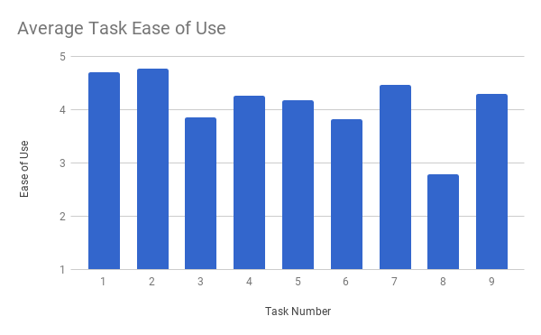
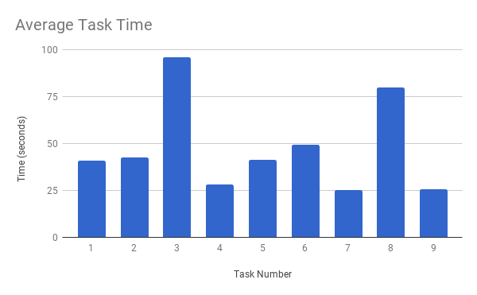
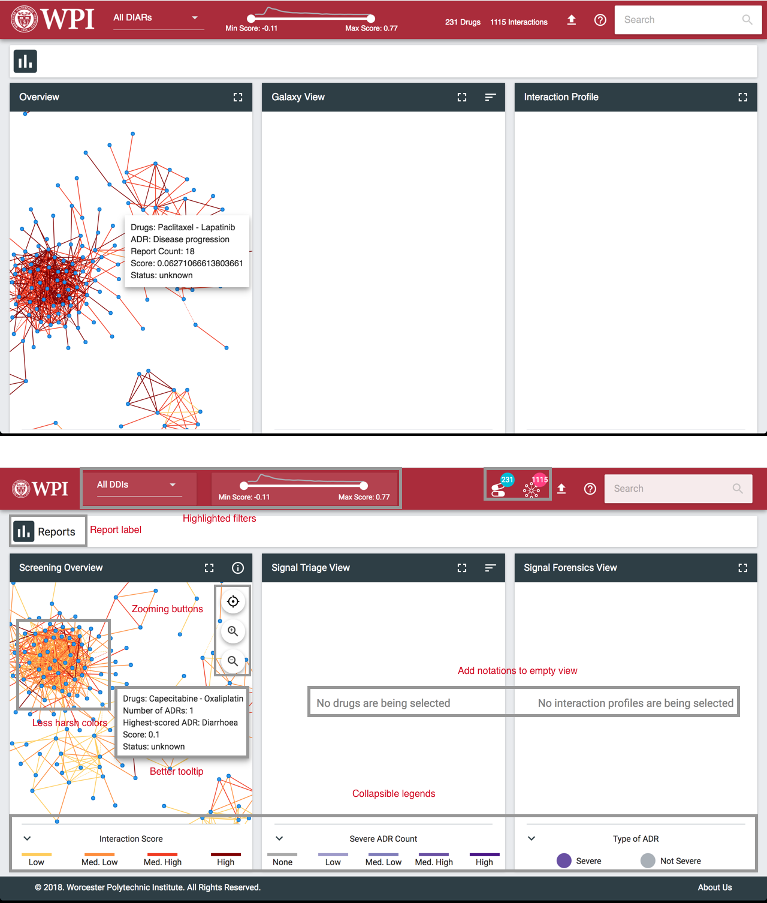

# Evaluation and Testing Results

<!-- This introduction to the Results chapter will introduce our results
by citing a key result from each section of testing and provide the key analysis
derived from that result, in brief, before transitioning to the first section. -->

In this section we present the results of the technical and usability evaluations outlined in @Sec:evaluation-and-testing. Overall, the technical results confirm that the system correctly mines drug-drug interactions and show that the choices made for adverse reaction and drug name standardization are logical. Meanwhile, the usability evaluation results indicate that MIAP aligns well with the FDA's requirements while highlighting areas for improvement, some of which were promptly addressed.

## Technical Results

<!-- This section is for discussion and analysis of the results of the
technical tests we conducted to ensure the correctness and functionality of the
backend portion of the MIAP application, which involved rewriting MARAS. We
will discuss how these results show whether the system meets the goals we
discussed in the last chapter. -->

### Validation of MIAP Output

As seen in @Sec:java-refactoring, after reimplementing the data mining part of the MARAS process in Java, we tested to ensure that the rules and itemsets generated by both systems were the same. Following testing with the same input data and parameters, we confirmed that the same 33782 itemsets and the same 374550 rules were generated, while accounting for an increased level of floating point precision. 

### Comparison of Techniques for ADR Standardization

Meanwhile, in @Sec:adverse-reaction-mapping we compared the use of two methods for adverse reaction mapping and standardization. The first method used a dictionary of term mappings, where any term matching one of the keys in the dictionary would be changed to the value associated with that key. This approach used the SIDER ADR hierarchy. On the other hand, we tried using MetaMap, a tool provided by the NIH for recognizing medical concepts and returning standardized names. As a result of this comparison, we decided to utilize MetaMap to standardize adverse reaction names between FAERS data and our database of known rules. This is because, while MetaMap appeared not to generalize as well as the SIDER ADR hierarchy since it resulted in a higher number of distinct ADRs overall, MetaMap did outperform the SIDER ADR hierarchy significantly in matching known rules, finding 56 compared with the 13 found by the SIDER ADR hierarchy.

### Quality of Drug Name Matching

As seen in @Sec:drug-name-matching, we conducted a series of 5 parameter-tuning passes to increase the performance of our drug name matching. Drug name matching was assessed using a random sample of 100 drug name mappings from each of the tuning passes. Once the random samples associated with each set of parameters was retrieved, we manually determined whether each mapping was "sensible" or not based on domain research and human observation. Then, the sensibility metric, described in greater detail in @Sec:drug-name-matching, was calculated for each sample, as well as the raw percent of mappings that were sensible. Through this process, we achieved a maximum sensibility metric of 0.855, which corresponded to 91% of the mappings being "sensible".

### Time Breakdown Analysis

Finally, we conducted a time breakdown analysis on the complete rule mining process to pinpoint areas in need of improvement. Then, after optimizations such as caching, we again conducted a time breakdown analysis for comparison, as seen in @Fig:time-analysis. The time savings evident from this comparison are significant; whereas before the process took over 4.5 hours to run, the optimized process ran in just over 40 minutes. With this reduction in running time, we were able to more quickly debug future additions to the process, as well as drastically reduce the time that a user must wait to visualize new data once it is uploaded to MIAP.

{#fig:time-analysis width=100%}

## Usability Evaluation Results

While there were originally two phases planned for the user evaluation, we chose to only conduct the user evaluation with WPI students due to time constraints. For this reason, this section focuses exclusively on the results from the evaluation with WPI students. The following results are based on user evaluations with 18 WPI students. These students varied in age from 18 to 22 years of age and all study Engineering. Of the 18 participants, 7 were female and 11 were male. These participants were acquaintances or volunteers.

The results from the user evaluation can be divided into user ratings and comments about specific tasks, user ratings and comments about more general elements of the user interface, and user ratings and comments about the visual appeal of the application. 

<!-- This section is for the summary and analysis of the results of our user study,
focusing on what our responses mean for the usability of our system. It will
cite various quotations from our notes, which will be attached as appendices. -->
### Specific Tasks
After conducting the user evaluation, the results indicated that overall the application performed well,
meeting each of its usability requirements except for Requirement [-@lst:req-6]. After each task, users
rated the ease of use of the task on a scale of 1 (being very hard) to 5 (being very easy). Of the nine tasks completed by 
participants, all but three received an average rating of 4 or higher (see @Fig:average-task-ease-of-use). Then, of these three, tasks 3 and 6 received an average
rating above 3.8. This leaves task 8 as the task with the lowest rating for ease of use at 2.79.

{#fig:average-task-ease-of-use width=100%}

Task 8 involved finding reports for interactions between two specific drugs. Users often only completed the task
by asking for help from the evaluator. This indicates that although the tour explains the purpose of the Report Chip
Container, users quickly forget its purpose or that it is even related to reports. After the user evaluation,
we added a "Reports" label to the Report Chip Container to address this issue at the suggestion of participants (see @Fig:changes-after-evaluation).

{#fig:average-task-time width=100%}

Another task of interest is task 3. Although it received an average ease of use rating of 3.85, this task confused some participants. 
Besides having the highest average time for task completion (95 seconds), as seen in @Fig:average-task-time, many users indicated their confusion about the term "severe ADR". This term is explained in the help menu that all users read before beginning tasks, as well as shown on the legends below the Galaxy View and the Interaction Profile View. The intent of the task was to get users to sort the galaxy view by severity and select the top drug. One possible source of this confusion could be that the legends were often not visible without scrolling down on the webpage, so they did not serve their purpose when users forgot they were there. To address this concern, we made the website's content dynamically resize to ensure that everything can be seen without scrolling. Additionally, each of the legends was refactored to give them a clear title that indicates what the colors represent. These changes are shown in @Fig:changes-after-evaluation.

Lastly, task 6 revealed an ambiguity associated with the report count for interactions between two drugs. Users received varying answers
for this task based on their methodology. One way users received the answer was by going to the Galaxy View for the first drug and hovering over the edge representing the interaction with the second drug. The tooltip displayed on hovering gave an answer of 28 reports. Meanwhile, some users went to the Report View for the first drug and using the barchart received an answer of 52 reports. This discrepancy occurred because the report count given in the Galaxy View only accounted for reports between the two drugs that also included the highest-scoring ADR between those two drugs, which is represented by the edge in the Galaxy View. Meanwhile, the barchart in the Reports View for a single drug shows the number of time that a given drug appears in any report that also contains that single drug. As a result, we decided to remove the report count from the tooltip over edges in the Overview and Galaxy View and instead add the total number of ADRs to the tooltip and change the label to say that the edge represents the highest-scored ADR (see @fig:changes-after-evaluation).

When asked, most participants indicated that the most difficult task was either task 3 or task 8, that is the task finding the drug with the most severe ADRs or the task finding the reports for interactions between two drugs.

### General Performance

After completing all of the tasks, users were asked to rate the general performance of the application in a variety of ways and then provide feedback in response to open-ended questions. Users rated the overall ease of use of the Overview, the Galaxy View, and the Interaction Profile View. In addition, they indicated how easy it was to remember or decide which combination of operations to use to answer a question and how easy it was to recover from errors. Of the three views, the Galaxy View was rated best for ease of use (4.35), followed by the Interaction Profile (4.11), and then the Overview (3.76). 

While rated highly, there was at least one major issue discovered with the Galaxy View. When completing tasks, users often assumed that the metaphor of dashed and solid lines (for known and unknown interactions) carried over from the Overview to the Galaxy View. However, the Galaxy View currently uses node size as the method of distinguishing between known and unknown interactions, with known interactions being represented by significantly smaller nodes. Otherwise, many users found that tasks were "made simpler" by going through the Galaxy View, as it filtered out a lot of the extra information provided by the Overview and facilitated the retrieval of any information related to a given drug. 

Next, there were a few complaints about the Interaction Profile. For example, some users experienced an issue where the ADRs were offscreen at the initial load of the Interaction Profile, and for this reason they did not realize you could find information about ADRs in the Interaction Profile View. Additionally, participants were confused when clicking on a node caused parts of the tree shown in the Interaction Profile to collapse. Some particpants also observed that when a drug interacts with many other drugs, it is difficult to examine the view and locate the desired information. For this reason, they suggested that "it might be better to represent the information in a table" so that the information can be displayed in a more concise manner. 

Finally, many participants were confused about why the Overview was necessary when the same information can also be found in the Galaxy and Interaction Profile views. However, this confusion is in part due to their lack of domain knowledge or experience, as the Overview is primarily for identifying highly-scored, unknown drug-drug interactions that require urgent attention. This cannot be done in the Galaxy or Interaction Profile views, as they only show information for specific drugs and do not facilitate the comparison between all interactions. Additional complaints about the Overview focused on how crowded the view is, with many interconnecting nodes in close proximity. However, for the purposes of initial screening by score and known/unknown status, this problem is mitigated using the relevant filters, and if users are looking for a specific drug, they can use the search bar.

The study showed that operation of the application takes some getting used to, as evidenced by the users' rating for ease of remembering combinations of operations (3.64). For example, some participants had trouble remembering where to click, whether it be on an edge or a node depending on the view, to achieve the desired effect. Along the same lines, users often forgot that clicking on nodes or edges produces report "chips" that can be used to find reports specific to the corresponding drugs or interactions.

Lastly, users indicated that it was fairly easy to recover from errors even if they began approaching a problem with a methodology that would not lead them to the answer, giving an average rating of 4. This is in part due to the quick response time of the application and the lack of long chains of operations being required to perform tasks within our application. If a user clicks on the wrong drug or interaction, they can simply select or search for the correct one, and the Galaxy and Interaction Profile views are updated accordingly. If a user goes to the report view and cannot find what they are looking for, they can close the view and continue analyzing the data they were looking at previously. Therefore, even if a user is still learning how to use the application, it is easy for them to recover from their mistakes and continue in pursuit of their information need.

### Visual Appeal

The visual appeal of the application was consistently rated highly by participants (average of 4.35 out of 5). One suggestion was to change the use of dashed and solid lines such that known interactions are represented by solid lines and unknown interactions by dashed lines. Another suggestion was to make the report window larger in order to see more of the large amount of information available there. Additionally, participants suggested removing the necessity for scrolling, changing the text color in the views to make it more visible when edges and text are overlapping, and changing the colors used for scores and severe ADR counts to make them "more distinct" and "less harsh". The concern about removing unnecessary scrolling was addressed by making the website's content dynamically resize to ensure that everything can be seen without scrolling. Furthermore, while the colors themselves were not changed, more variability was added by distributing the colors uniformly according to the score and severe ADR count distributions. As a result, most of the edges in the Overview that were previously a dark red color are now a milder yellow color. These changes can be seen in @Fig:changes-after-evaluation.

{#fig:changes-after-evaluation width=100%}
