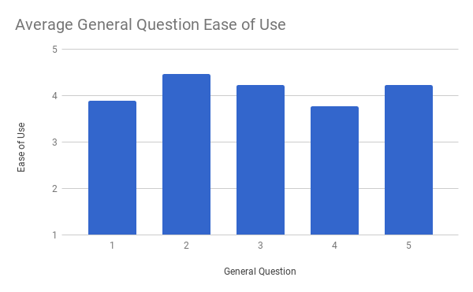

\appendix

# Usability Evaluation Materials

## Evaluation Script for WPI Student Surveys

-   \[Introduction: Who we are, what our project is, what is DIVA?\]

    -   We are \[names\], and we are an MQP team working on the DIVA
        system. DIVA is a web application that visualizes drug
        interaction data so safety evaluators can more easily identify
        and investigate potential Adverse Drug Reactions, or ADRs.
        ADRs are unwanted side effects that are caused by taking one
        or more drugs; for example, taking Aspirin and Warfarin
        together can cause excessive bleeding. It can be especially
        difficult to discover interactions between multiple drugs in
        clinical trials, because it’s impossible to test every drug
        combination.

    -   Our system uses data mining with adverse reaction data collected
        by the FDA to find likely ADRs caused by the interaction of
        multiple drugs. The DIVA platform allows users to examine the
        results of that analysis in a variety of ways. The potential
        ADRs found by the DIVA system are scored based on how likely
        or significant the interaction is.

-   Do you have any questions so far?

-   \[Interface: Introduce each View\]

    -   Now we’re going to introduce you to the DIVA interface. Clicking
        on the question mark in the top-right corner will bring up a
        help menu that will give you a description of the system and
        walk you through the interface. Please open that help menu and
        read the contents now.

    -   \[Once they are done\] Now we’re going to ask you to do a few
        tasks using the interface. Take as long as you need to
        complete each task. As you are working, tell us what you are
        thinking or feeling, what you’re confused by, and any other
        comments you have. If, at any point, you feel that you are
        unable to complete the task, just let us know and we can move
        on to the next one. Are you ready to start?

-   Data we will record during each task

    -   **Time elapsed** while a participant is completing the task

    -   **Answer(s)** given by participant in response to the task

    -   The **methodology** that the participant used to complete the
        task

    -   **Level of guidance/assistance** requested from the participant
        while completing the task

    -   **Comments** from participants that indicate confusion or
        provide feedback as to the quality of the interface/system

-   \[Tasks\] - after each task, the participant will be asked to rate
    that task’s difficulty on a scale of 1 to 5, where 1 is very easy
    and 5 is very hard

    -   Overview **\[R1\]**

        -   **Task 1 \[R3, R4\]:** Find 3 unknown drug-drug interactions.

        -   **Task 2 \[R2\]:** Find 3 drug-drug interactions with a score
            higher than \[0.5\]

    -   Galaxy View

        -   **Task 3 \[R2, R5\]:** Find and select drugs Trazodone, Metaxalone,
            and Tylenol. Of these drugs, which drug has the highest
            number of severe ADRs.

        -   **Task 4 \[R2, R3, R4\]:** For drug Metaxalone, how many high scored
            \[score &gt; 0.2\] and unknown interactions are there?

    -   Interaction Profile

        -   **Task 5 \[R2\]:** Please find what ADRs occur between drugs
            Trazodone and Diazepam.

        -   **Task 6 \[R6\]:** How many reports support the above interaction?

        -   **Task 7 \[R2, R5\]:** Find all severe ADRs associated with
            Trazodone’s interactions.

    -   Report View **\[R6\]**

        -   **Task 8:** Please open the reports for the interaction between drugs
            Zoloft and Tylenol.

        -   **Task 9:** List the three most frequent drugs reported with the
            interacting drugs Zoloft and Tylenol.

-   Multiple Choice Questions

    -   On a scale of 1 to 5, how easy was it to:

        -   **Question 1:** Interpret the information contained in the overview

        -   **Question 2:** Interpret the information contained in the galaxy view

        -   **Question 3:** Interpret the information contained in the profile view

        -   **Question 4:** Remember/decide which combination of operations to use to
            answer a question

        -   **Question 5:** Recover from errors once I realized a given approach would
            not lead me to the information I needed.

    -   On a scale of 1 to 5, how visually appealing is the interface,
        where 1 is not appealing at all and 5 is extremely appealing?

-   \[Open-ended Questions\]

    -   Which task was the most difficult to complete? What made it so
        difficult?

    -   Which parts of the interface are the most difficult to
        understand? Why?

    -   Which parts of the interface are the most difficult to use? Why?

    -   Is there any way you could think of to make the interface easier
        to understand?

    -   Is there any way you could think of to make the interface faster
        to use?

    -   What would you change, if anything, to make the interface more
        visually appealing?

## Evaluation Script for FDA Researchers

-   \[Introduction: Who we are, what our project is, what DIVA is\]

    -   We are \[names\], and we are an MQP team working on the DIVA
        system. DIVA is a web application that visualizes drug
        interaction data so FDA drug safety evaluators can more easily
        identify and investigate potential Adverse Drug Reactions, or
        ADRs.

-   \[Preliminary Questions\]

    -   What is your role at the FDA?

    -   How do you work with ADRs and FAERS data?

-   \[Introduction to DIVA platform\]

    -   Our system uses data mining with data collected by FAERS to find
        likely ADRs caused by the interaction of multiple drugs. The
        DIVA platform allows users to examine the results of that
        analysis in a variety of ways. The potential ADRs found by the
        DIVA system are ranked by their contrast score. This
        essentially weighs how likely it is that a reaction is a
        result of taking multiple drugs in combination versus taking
        one of the drugs individually.. For example, in the case of
        Aspirin and Warfarin, when someone takes both of those drugs
        together, there is a high chance that they will experience
        excessive bleeding; however, when they take either drug on
        their own, the chance of them experiencing that reaction is
        relatively low. This indicates that the interaction between
        Aspirin and Warfarin likely causes excessive bleeding, and so
        that interaction would have a high contrast score.

-   \[General Questions\]

    -   How would you use a tool such as the one described above? What
        are the main features you would look for in a similar tool?

-   \[Show them the Interface\]

    -   Here is the DIVA Interface. Clicking on the question mark in the
        top-right corner will give you a brief description of how to
        use the platform. Please open the help menu and read it now.

    -   Do you have any questions about the interface?

    -   Thinking back to how you said you would use such a tool, try to
        use the interface in each of those ways.

    -   On a scale of 1 to 10, how useful do you think this interface
        would be for your day-to-day job, where 1 is not useful at all
        and 10 is invaluable?

    -   What feature or features do you think are most useful to you?

    -   What feature or features do you think would be least useful to
        you, if any?

    -   What changes or improvements would you make to this interface to
        make it more useful to you as an FDA employee?

    -   On a scale of 1 to 10, how difficult is this interface to
        understand, where 1 is not difficult at all and 10 is
        extremely difficult?

    -   Do you have any additional questions or comments for us?

## Usability Evaluation Additional Results

